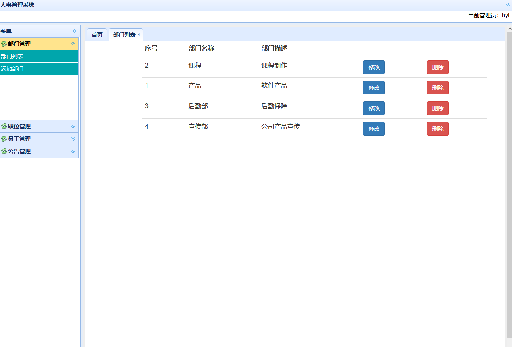

# 基于SSM的人事管理系统

## 整合SSM框架（SpringMVC + Spring + MyBatis）

## 使用技术：

​	IOC容器：Spring

​	Web框架：SpringMVC

​	ORM框架：Mybatis

​	数据源：C3P0

​	日志：log4j

​	前端框架：Bootstrap，EasyUI

### 运行环境和所需工具

​	编译器：IntelliJ IDEA

​	项目构建工具：Maven

​	数据库：Mysql5.7

​	JDK版本：jdk1.8

​	Tomcat版本：Tomcat8.x

